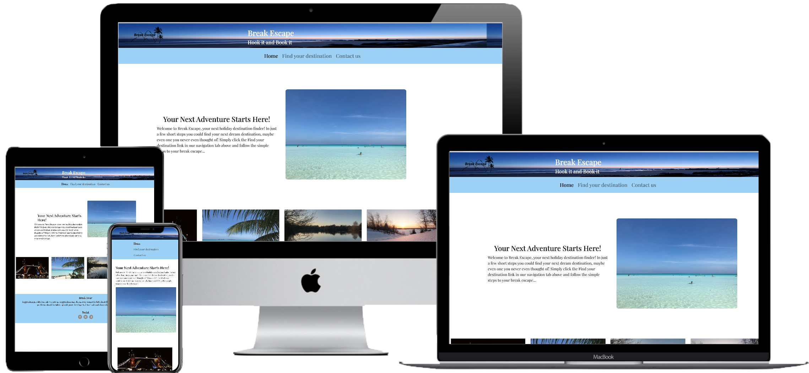
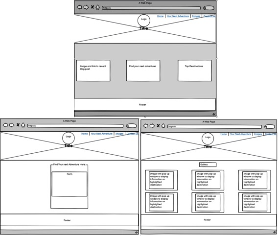
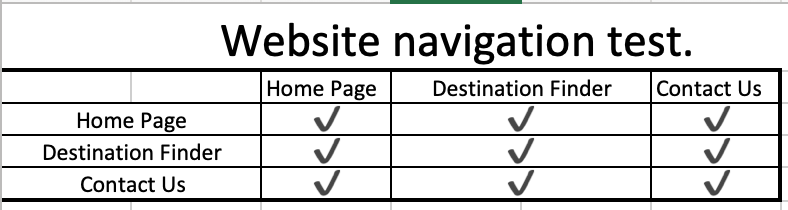
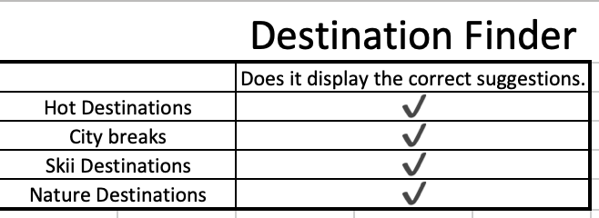
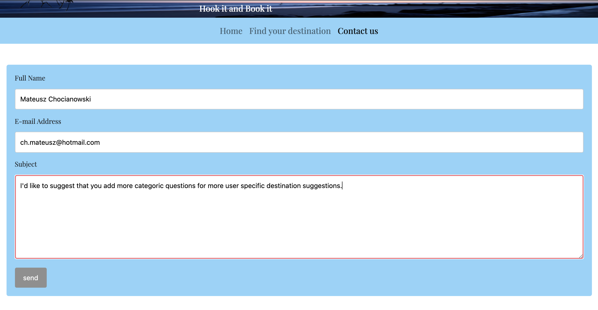
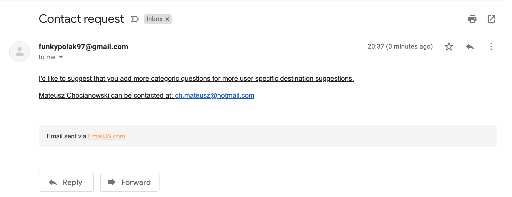
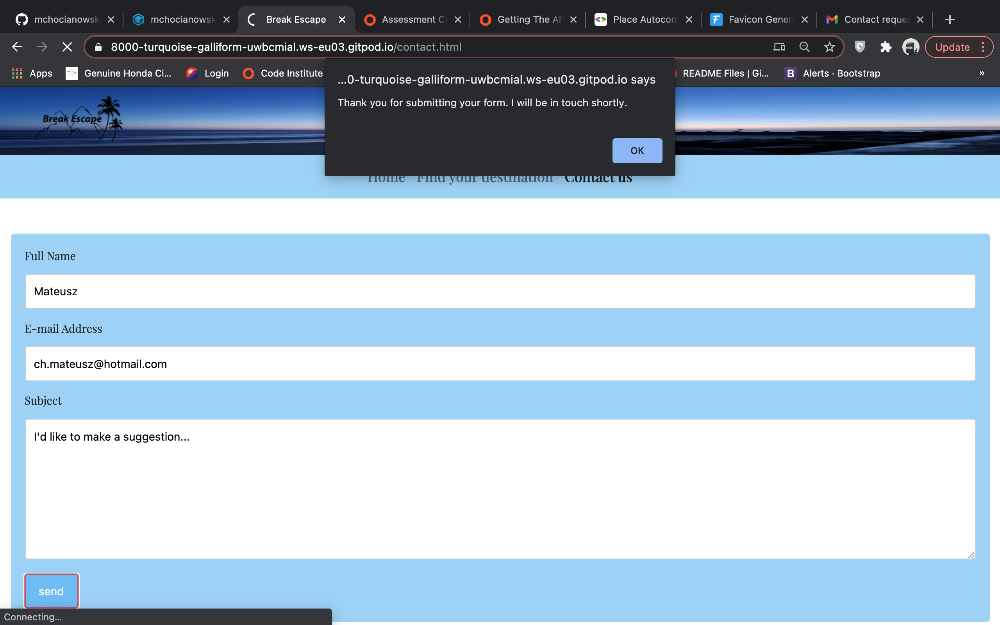
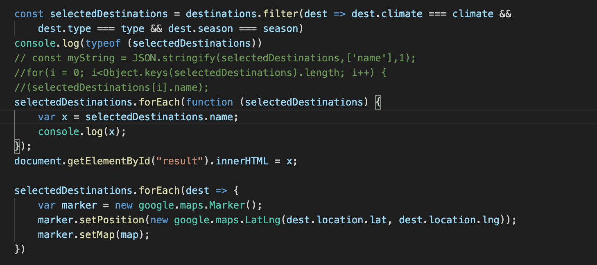

# **_Milestone-Project-2-Holidays_**  

# **_Introduction:_**

This is my second milestone project for the code institute. The project objective
is to design an interactive front-end site using what I have learnt during the javascript modules whilst integrating 
previously aquuired knowledge of HTML and CSS. For this project I will be designing an online destination finder 
where a user can answer a few short questions and the program will evaluate these against an array of objects 
and output a series of suggested destinations.
I feel that inititiating this idea during this project is a storng foundation for a future expansion and will 
improve my portfolio.
Click here to find my project: https://mchocianowski.github.io/Milestone-Project-2-Holidays/

# **_Purpose:_**
The website above was created for the purpose of achieving the second Milestone Project for the Code 
Institute's Full Stack Developer course.The website was developed using the knowledge gained from the Javascript
and interactive frontend developement modules as well as my pre-aquired knowledge of HTML and CSS.

# **_User Experience Design:_**

## *User Stories:*
* As a user, I want to be able to see lots of imagery setting me in the holiday mood.
* As a user, I want an easy to use experience with minimal computer knowledge I'd like to be 
able to navigate the site and achieve my purpose.
* As a user, the purpose of me visiting the site is to find a holiday suggestion. There are so many great places 
to visit and it can be hard to make the choice yourself when trying to book a hard earned break. 
* As a user, I would like to be able to contact the company Break Away incase I have an issue or a 
recommendation with/about the site.

## *User Story Testing:*
* Index.html is the first page, the page is kept simple, it has pictures and a small piece of text which introduces 
the user to the site, accompanied with a lovely image of the sea getting the user in the right spirit.
* The website is kept simple, there isn't a cluster of information or an overly complicated way to navigate the site.
The bootstrap navbar is clearly laid out underneath the header and doesn't flood the user with choices it links the
user to what they need and thus does it's job.
* Keeping the questionnaire simple, keeps the user from getting caught up with holiday choices,
booking a holiday is supposed to be an enjoyable experience. With the internet becoming the go to by more
and more users of various computer and internet knowledge, keeping the questions and answers simple and minimal allows 
a result within seconds which can be further researched at their own leisure. 
* Again as with the destination-finder form. the contact form is simple, the user does not need to go through any long 
process or struggle to find a contact source. The page is clearly linked and it is a simple to fill in form which using the
emailJS api will send the company an e-mail.

## *The Surface Plane:*

### *The font:*

The type of font used in the website was something very similar to the fonts commonly used e.g. Times New Roman
because it provides a more up to date visual that would allow users to see that the website isn’t falling into a 
trap where it is seen as a more outdated, it still gives a professional outlook. It does this by being readable, 
there isn’t any curly letters that can make it hard to read, but it is still bold and professional enough to 
stand out on the page. The spacing between each letter also allows it to be more easily read for a wider range 
of audiences.  

### *The imagery:*

The images chosen for body of this website is aimed to show the type of locations that the viewers could be heading to.
there is a beach, city and nature image that have been taken by myself and all have the same style of photography which 
creates a smoother viewing experience. The skiing image was found on google but also had to match the style of the images 
I have taken. They are set out in four boxes at the bottom of the page so that it is organised and easy to see. The 
introduction image is set out next to the text to draw the user to the information.  The header image is also an image 
taken by myself and fits into the space without over complicating the header.

The logo was created to show the diverse holidays that are being compared. With showing a palm tree and mountains with 
the name showing above the image. It is simple so that it fits well with any image that it was placed with. 
 
### *The colour scheme:*

The colour scheme consists of light blue, white, grey and black. These have been chosen because these are the colours 
in the images. Keeping the colour scheme matching the images means that it’s easy to look at and remains slick. The 
light blue works so that people can focus on the idea of the page rather than being distracted with bolder colours. The 
colour of the text is black so that it contrasts with the light blue and it easy to read. The logo was also chosen to 
be black so that it fit with any image and is still readable. The submit on the contact page and the find your destination 
page as well as the social buttons in the footer are grey and will turn a different shade of blue than the background 
colour when hovered over, so that they stand out and are easily noticed. The blue is to tie in with the theme of the 
website. 

## *Skeleton:*
 

## *Differences to design:*
As can be seen when comparing my wireframes to my final website, the two are a little different, I initially wanted
more pages. I wanted a gallery for the holiday destinations. However, this wouldn't directly reflect what i have learnt 
throughtout the recent modules hence including this for the time being wouldn't benefit the project. I also chose not to 
have the navbar on top of the header image, it would not contrast well and would create issues with the websites usablility. 
Moreover having the logo directly above the header would have made the layout clustered, the header would take too much 
space on small devices and so I chose to layout the website in a more simplistic way which works. The wireframe for the 
first page also shows only 3 images with some links to the other pages. I did not use this idea due to the fact that 
there would be alot going on in one page, making it slower to load and a less efficient design which would take a toll on the 
user experience.

## *Structure:*

For a website to be able to meet their user needs this website needs to be simple for finding information quickly, 
easy to use and most importantly provide the relevant information. This website provides all of these things. 
It’s simple in the way that there isn’t too mush going on, with aspects such as design and depth of narrative. 
The links that are allocated to each page are easy to follow and very obvious with being centred and having 
enough space between each link, meaning that users are able to spot them easily and one of the first things 
they are drawn to. And finally the website is easy to use because there are three pages to the website each 
one doing their own job without steering away from relevant information. 
The information that they are primarily looking for is to find a holiday destination idea. This can be done with 
ease similarly to contacting Break away using the simple contact form.
 
## *Scope*

The planned features for the website are:

* A website logo- This is the business logo, it was made by myself in adobe photoshop and more is written 
about it in the imagery section of this readme.

* A Page Heading- The page heading for a holiday site should be the company name and a slogan.

* Find your destination- The page where the user can fill in their choices and get a holiday suggestion.

* Google Maps api- The Google Maps api will display results of the holiday suggestion on a map.

* A contact form- There will be a contact form to allow any customer or user of the site to fill in the form and be 
contacted back using the details past over using the contact form and an e-mail api.

* A thank you message after form submission- The thank you message will display upon form submission, this is to acknowledge 
the user and to inform them that the form was successfully submitted.

* A blog page where previous users can share their travel experience.

* A gallery page which can highlight the wonderful destination suggestions offered by Break Escape.

## *Website Features*
### *Existing:*
* A website logo

* A Welcome image- accompanied by a captive welcome paragraph, it engages the user and welcomes them to the site.

* Find your destination

* Google Maps api.

* A contact form.

_Note_: The current implemented features differ from the initial proposal. The reasons for this are that the blog would 
not work as there is no way to store the users information due to a lack of a server. The gallery page, although an idea which I'd still happily add 
would not highlight any particular code that I have spent time learning therefore for the purpose of time I decided to save this for another time.

### *Future:*
In the future, I'd like to be able to make the website more interactive, have more categories of questions thus alllowing more accurate suggestions. 
The google maps api would show a pop up when a pointer is clicked on with information about the place. I'd like to add Jquery to images and have more 
information about places slide down, again improving the functionality of the website.

## *Strategy:* 
As a creator of this website, the business needs, need to be met. In this instance, the pages need to be engaing, they should allow the user 
to be in a holiday mood from the moment the first page loads. If the first page engages the user and looks like something that will help them,
it will convince them to use this as a means of finding their next holiday destination and as a result the popularity of the site will grow allowing 
for bigger possibilities in the future such as signing with a few tourist agencies so the suggested destinations are displayed, a tourist agency 
offering the best deal for this destination will be linked. This adapts to what the users need and want.

## *technologies*

* HTML
    * HTML is the main language used to complete the structure of the Website throughout milestone project two.
* CSS
    * CSS is the language used to style the website in milestone project two.
* Javascript
    * Javascript allows the website to become more responsive rather than a page with information on it.
* Google Maps api
    * The Google Maps api displays location pointers on a world map.
* EmailJS api
    * The EmailJS api allows the form to be responsive and actually do it's job of notifying the company when a 
    user has contacted them with a query.
* Google Chrome Developer Tools
    * Google chrome built in developer tools were used to inspect page elements and help debug issues.
* Google Fonts
    * Google fonts are used throughout the project to import the Playfair Display and serif fonts.
* Bootstrap
    * Bootstrap framework was used for layout during this project.
* Font Awesome
    * Font awesome Icons were used for the Social media links contained in the Footer section of the website.
* Techsini
    * Multi Device Website Mockup Generator was used to create the Mock up image in the readme.md file.
* GitHub
    * GithHub is the hosting site used to store the source code for the Website.
* Git
    * Git is the version control software used to commit and push code to the GitHub repository 
    where the source code is stored.
* Balsamiq Wireframes
    * Used to create wireframes for User experience design.
* Favicon
    * Favicon.io was used to make the website favicon.

## *Testing*
Testing is a vital part of programming, it ensures the code which has been written actually works and is not 
filled with bugs, if it is... It needs to be debugged.
My final test reults can be seen underneath.

* My first test is to ensure all the website links work:

* My second test is to make sure that all the destination suggestions appear as they should:
.

* Another test was to ensure the Emailjs api works correctly.

* Form submission acknowledge:

* Whist the above tests passed, which I'd expect, debugging the code was a continous part of my project...
These issues consisted of:
* Initially my forEach loop would display all required possibilites in the console however 
in the browser window this was not the case. In the browser window only the last possible outcome was listed.

The issue was caused by the line which sends the code to html, I made it equal variable x.
to get around this trouble, I put a plus infront of the equals sign which then made the loop add 
new objects on top of the previous ones when the user 
selected new values. To get around this issue I sent an empty string to the html before the loop. This meant 
that before the loop is run an empty string would be displayed which cleared previous results.
* Additionally to this I then had the issue that when values were not found nothing would be displayed. This is needless 
to say bad practice as the website looks broken. To solve this, I made an if statement which checked against the 
selectedDestinations array and if the value of the array is 0 then a message shows up acknowledging the fact that 
no results were found. This proves to be a better soloution because at least there is a message to the user explaining 
that something they have entered does not compute correctly.
* An issue which I was unable to solve due to limited knowledge but would like to understand how to solve in the future 
in this case is; the user is able to select values which shouldn't matter in certain situations. For example when looking 
for a City Break, the type of climate and season of travel should not matter therefore ideally those two conditions 
would not be taken into consideration. However, since I was not able to fix this, I implemented a message to the user 
on instruction how to search for these types of destinations.

## *Deployment*

### *Project creation:*
I started the project by retrieving the template supplied by code institute and clicking 'Use this template'. 
I named the repository: Milestone-Project-2-Holidays and selected the 'Include all branches' checkbox. 
Once the above steps were complete I opened the newly created repository and clicked the green gitpod 
button which took me to gitpod where I began the coding.

I used the following commands throughout the project:
git commit: commit message explaining the updates, this command was used to to commit changes to the local repo.
git push: The command is used to push all commited changes from the local repo to the GitHub repository.

### *Deploying Using Github Pages:*

    * Navigate to the GitHub Repository:
    * Click on the 'Settings' Tab.
    * Scroll Down to 'Git Hub Pages' Heading.
    * Select 'Master Branch' as the source.
    * Click the Save button.
    * Click on the link to go to the live deployed page.

### *Deploying by running off a local machine:*
    * Begin by Navigating to the GitHub Repository.
    * Then click the Code drop down menu.
    * You can either choose to Download the ZIP file, unpackage locally and open with IDE (This route ends here) 
    alternatively copy the Git URL from the HTTPS dialogue box.
    * Open your developement editor of choice and open a terminal window in a directory of your choice.
    * Use the 'git clone' command in terminal followed by the copied git URL.
    * Finally a project clone will be created locally on your machine.

## *Citations* 
* [Assessment criteria](https://courses.codeinstitute.net/courses/course-v1:CodeInstitute+IFD101+2017_T3/courseware/e4482ae18d3142f7ba989b247b2e5ba9/d28b5efca8d4424ab3095f65010b3181/?activate_block_id=block-v1%3ACodeInstitute%2BIFD101%2B2017_T3%2Btype%40sequential%2Bblock%40d28b5efca8d4424ab3095f65010b3181).

* Implementing the [EmailJS api](https://www.emailjs.com/docs/rest-api/send-form/).

* [Winter Image](https://www.scotsman.com/lifestyle/outdoors/when-do-days-start-getting-lighter-longer-date-clocks-go-forward-and-spring-begins-3060322).

* Gathering [GPS Coordinates](https://www.gps-coordinates.net/).

* Implementing the [Google Maps api](https://developers.google.com/maps/gmp-get-started#quickstart).

* Applying a [forEach loop](https://stackoverflow.com/questions/16626735/how-to-loop-through-an-array-containing-objects-and-access-their-properties).

* Using flex box to create a [card layout](https://getflywheel.com/layout/flexbox-create-modern-card-design-layout/).

* [Javascript objects](https://www.w3schools.com/js/js_object_display.asp). 

* My Mentor Dick Vlaanderen, guiding me through linking the google maps api to my forEach loop.

#### _Previous milestone project citations used in this project also..._

* Onsubmit event was taken from [here](https://www.w3schools.com/jsref/event_onsubmit.asp).

* The inital footer code was taken from rosie's [project](https://github.com/Code-Institute-Solutions/resume-miniproject-bootstrap4/blob/master/09-adding-footer-content/assets/css/style.css) It was then edited to suit my needs.

* The intial contact form code was taken from [here](https://www.w3schools.com/howto/howto_css_contact_form.asp).

* The Nav bar code was taken from [bootstrap](https://getbootstrap.com/docs/4.0/components/navs/) where I also learnt about horizontal alignment of the nav bar.

* [Google Fonts](https://fonts.google.com/specimen/Playfair+Display?sidebar.open=true&selection.family=Playfair+Display:wght@400;500;600;700;800;900).

* [Colour Hex](https://www.colorhexa.com/007600).

* [Multi Device Website Mockup Generator](http://techsini.com/multi-mockup/index.php).

* Create a [Favicom](https://favicon.io/favicon-converter/).

* [5 User planes](https://ozchen.com/5-planes-content-strategy/).

* [User story writing](https://www.mountaingoatsoftware.com/agile/user-stories).

* [Website Wireframes](https://balsamiq.com/).

## *Comments*
As final comments I'd like to mention that I feel as though my understanding about programming
has really improved since my milestone 1 project. HTML and CSS have become much easier to use,
the ability to implement Javascript has allowed me to design a more interactive and responsive site. 
I feel like I have taken steps to improve my commits keeping them in present tense, however I am concious 
of the fact that I can still work on remembering to commit work before it becomes too much work to lose.
This would definetly make my work more efficient since often I am doubling the time spent in doing things 
to fix issues I have caused. A second problem that i have encountered is that, when an issue arises whilst creating 
the website i am focused on fixing the issue straight away instead of noting it down. Adapting to this would allow me to 
sooner spot and fix issues because the solution would be to hand. It would also allow me to have a stronger and 
more detaied readme. 
